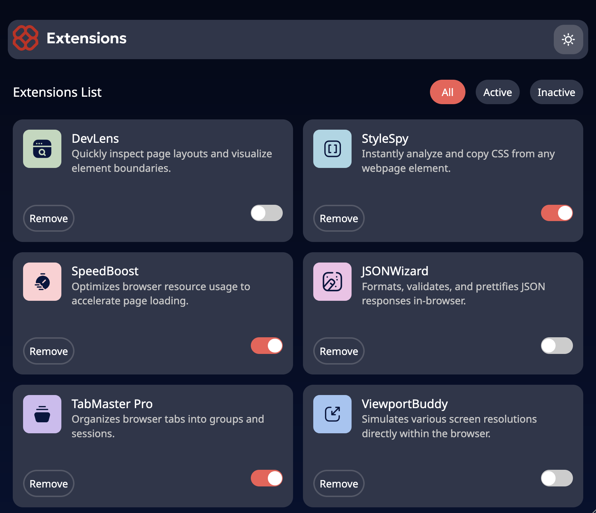
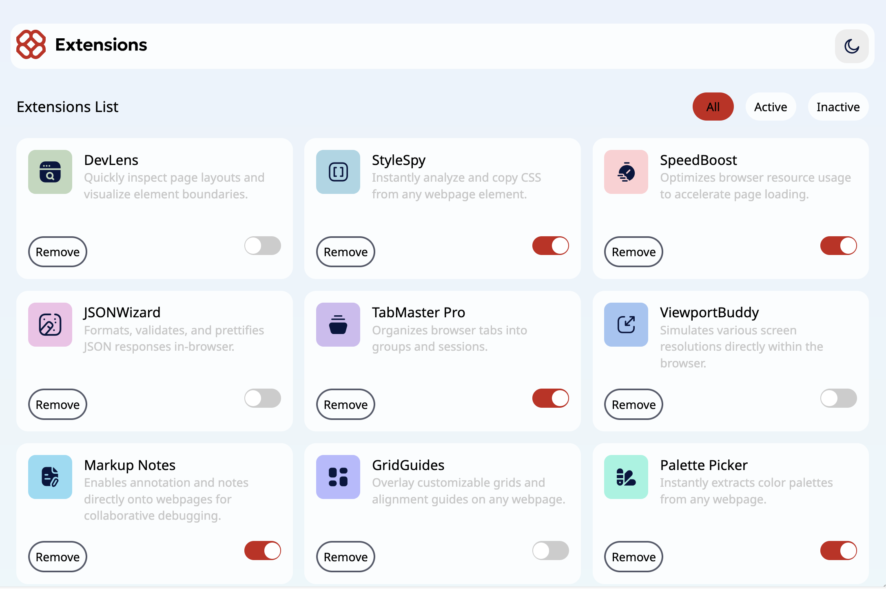

# Browser Extension Project from Frontmentor

This is a junior level front-end project which I have completed using React-Vite with Typescript superset. Quite easy but fun and great to refreash and practice front-end skills.

## Features

The responsive layout displays a list of browser extensions that has its source in JSON format file. To track changes data is copied into a state variables hence it is quite easy to keep track of any changes.

## Themes

Despite low cmplexity of a project it was valuable as I discovered an easy way to build and switch between light and dark themes. CSS is extreamly powerful tool and fun to work with.

## Technologies

  * [Typescript](https://www.typescriptlang.org/)
  * [React](https://reactjs.org/)

## Launch

To get started clone the repository and install the dependencies. Inside project directory start localhost server

> npm run dev